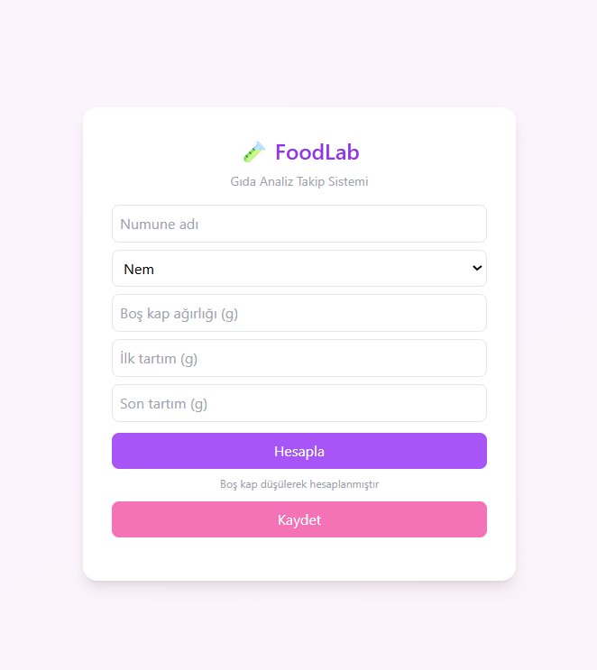
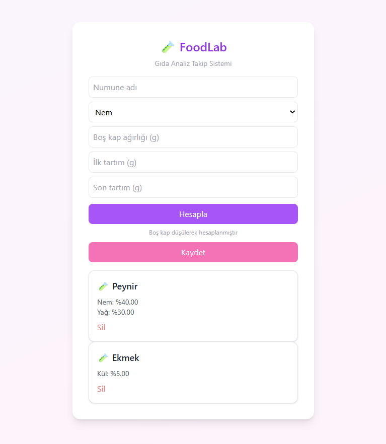

# 🧪 FoodLab – Gıda Analiz Takip Sistemi

FoodLab, gıda mühendisliği laboratuvarlarında yapılan temel analizlerin (Nem
Tayini, Kül Tayini, Yağ Tayini) web tabanlı olarak hesaplanmasını ve kayıt
altına alınmasını sağlayan bir frontend uygulamasıdır.

Bu proje, Web Geliştirme eğitimi kapsamında ReactJS kullanılarak geliştirilmiş
olup, eğitimde işlenen TODO App mantığı baz alınarak CRUD işlemleri
uygulanmıştır.

---

## 🎯 Proje Amacı

Bu proje fikri, gıda mühendisliği okuyan bir arkadaşımın laboratuvar analizleri
için merkezi ve basit bir web tabanlı hesaplama ve takip sistemi olmadığını
belirtmesi üzerine ortaya çıkmıştır. Bu ihtiyaçtan yola çıkılarak, temel analiz
hesaplamalarını yapabilen ve sonuçları numune bazlı saklayabilen bir uygulama
geliştirilmiştir.

Laboratuvar ortamında yapılan analizlerde hesaplama ve kayıt süreçleri
genellikle manuel yürütülmektedir.  
FoodLab, bu süreci dijitalleştirerek:

- Analiz sonuçlarını otomatik hesaplamayı
- Numune bazlı kayıt tutmayı
- Aynı numune altında birden fazla analizi listelemeyi

amaçlamaktadır.

Uygulama gerçek analiz cihazlarının yerine geçmez, yapılan ölçümlere göre
sonuçları hesaplayan ve kayıt altına alan basit bir takip sistemidir.

---

## ⚙️ Kullanılan Teknolojiler

- ReactJS
- Vite
- Tailwind CSS
- JavaScript
- HTML5
- CSS3

---

## ✨ Özellikler

- Numune ekleme
- Analiz türü seçimi (Nem / Kül / Yağ)
- Otomatik yüzde hesaplama
- Aynı numune altında çoklu analiz desteği
- Listeleme
- Silme
- Responsive arayüz
- Modern ve sade tasarım

➕ Büyük/Küçük Harf Duyarsız Numune Eşleştirme

Uygulamada numune isimleri büyük/küçük harf duyarsız şekilde
karşılaştırılmaktadır. Bu sayede:

peynir

Peynir

PeYnir

gibi farklı yazımlar aynı numune olarak algılanır ve tek kart altında toplanır.

## Bu özellik, kullanıcı kaynaklı yazım farklılıklarının veri bütünlüğünü bozmasını engeller.

## 🧮 Kullanılan Hesaplama Formülleri

### Nem Tayini

Nem (%) = (Numune Ağırlığı – Kurutma Sonrası Ağırlık) / Numune Ağırlığı × 100

### Kül Tayini

Kül (%) = (Kül Ağırlığı / Numune Ağırlığı) × 100

### Yağ Tayini

Yağ (%) = (Yağ Ağırlığı / Numune Ağırlığı) × 100

---

📸 Uygulama Görselleri

<div style="display:flex; gap:20px;">
  
  
</div>

---

## 📁 Proje Klasör Yapısı
foodlab/
│
├── public/
│
├── screenshots/          # README için uygulama ekran görüntüleri
│   ├── screenshot1.png
│   └── screenshot2.png
│
├── src/
│   ├── components/
│   │   └── TestItem.jsx
│   │
│   ├── pages/
│   │   └── Home.jsx
│   │
│   ├── interfaces/
│   │   └── Test.js
│   │
│   ├── App.jsx
│   ├── main.jsx
│   └── index.css
│
├── index.html
├── package.json
├── tailwind.config.js
├── vite.config.js
└── README.md


---

🌍 Canlı Demo
Proje Netlify üzerinden yayına alınmıştır:

🔗 https://wonderful-licorice-fd1db0.netlify.app/

📝 Not
Bu proje eğitim amaçlı geliştirilmiştir. Gerçek laboratuvar cihazlarının yerine geçmez, yalnızca girilen ölçüm değerlerine göre hesaplama yapan ve sonuçları kayıt altına alan bir frontend uygulamasıdır.

👩‍💻 Geliştirici
Miray Bayan
```
